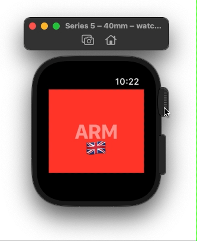

# ARMDemo
A very basic Apple Watch app that demos how to get the SwiftUI ScrollView position on the watch.

This was done as an ARM architecture demo for class, that's why you'll see a list of names at the end.

